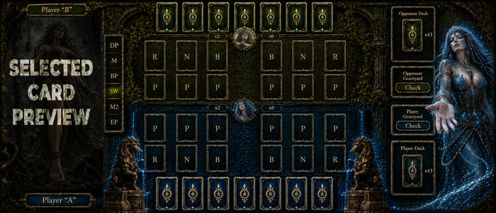

# Elemental Queens — Sumerian Edition

Sumerian tactical TCG concept preview: four primordial Queens, elemental devotion, and a chess-like battlefield where every wound burns through the deck.

<p>
  <a href="https://kurone-ko-elementaltcg.pages.dev/"></a>
  <a href="LICENSE"></a>
</p>



## What this is

**Elemental Queens — Sumerian Edition** is a portfolio/concept landing page for a tactical trading-card videogame idea.

It presents the game mood, board language, card vocabulary, and divine conflict without pretending the product is already released. The live preview is the best way to inspect the cards, battlefield, and mobile interactions at full quality.

## The pitch

Four elemental Queens judge humanity through a ritual battlefield:

| Queen | Element | Role in the myth |
|-------|---------|------------------|
| Nammu | Water | Origin, abyss, memory, and first life. |
| Utu | Fire | Judgment, revelation, punishment, and clarity. |
| An | Air | Distance, sky, aspiration, and unreachable order. |
| Ki | Earth | Ground, grave, harvest, service, and endurance. |

Players bind themselves to a Queen and fight across a structured grid. The pressure is not only board control: when a unit loses a clash, cards are destroyed from the deck. Your strategy is your army, your resource, and your remaining life.

## How the game reads

The landing introduces the core language in layers:

- **Allies** hold the battlefield: Pawns, Bishops, and Knights define the tactical line.
- **Rooks** are sacred structures: gates, temples, archives, and ziggurats.
- **Energy** pays costs and opens the path for divine manifestation.
- **Talismans** hide ritual answers and rule-bending turns.
- **Queens** enter at the threshold of seven energy and reshape the field through sacrifice.

The battlefield uses visible phases — `DP`, `M`, `BP`, `SW`, `M2`, `EP` — so the board feels closer to a ritual chess diagram than a generic card table.

## Visual direction

The interface follows a dark Sumerian reliquary language: black stone, gold ornament, blue elemental glow, cuneiform-inspired framing, and goddess-centered card art.

This README intentionally avoids tiny card thumbnails. Card text is small by design, so explanatory visuals must stay readable. For card-level detail, use the production preview instead of compressed Markdown images.

## Tech stack

| Layer | Tooling |
|-------|---------|
| Framework | Astro |
| Language | TypeScript strict |
| Styling | Tailwind CSS + custom theme CSS |
| Testing | Playwright E2E + custom QA contracts |
| Deployment | Cloudflare Pages |

## Run locally

```bash
npm install
npm run dev
```

Production build:

```bash
npm run build
```

## Quality checks

```bash
npm run typecheck
npm run qa:landing-flow
npm run test:e2e
```

## Deployment

The production preview is deployed on **Cloudflare Pages**.

| Setting | Value |
|---------|-------|
| Build command | `npm run build` |
| Output directory | `dist` |
| Production URL | https://kurone-ko-elementaltcg.pages.dev/ |

Large hero videos were optimized to stay within Cloudflare Pages limits while preserving the cinematic landing experience.

## Project status

This repository is a **concept preview and portfolio project**. It documents the Sumerian Edition direction, the current landing experience, and the technical foundation used to present it.

Roadmap names in the landing are concept directions, not product commitments, release dates, pricing promises, platform availability, or beta/demo announcements.

## Author and rights

**Author:** DevMPoveaCL

See [LICENSE](LICENSE).

© DevMPoveaCL. All rights reserved. This project is shared as a portfolio/concept preview and is not licensed for reuse, redistribution, or commercial use without permission.
